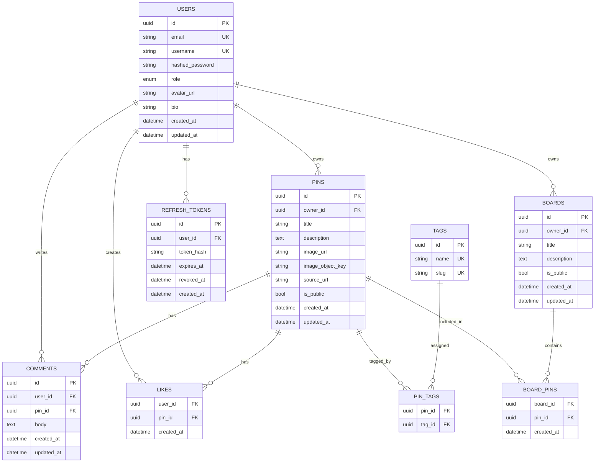

# Maxirest (MVP)

## Краткое описание проекта
**Maxirest** — это учебное Pinterest-like веб-приложение для работы с визуальными пинами, досками и тегами.
Цель MVP: за 1 неделю собрать аккуратный full-stack проект с понятной архитектурой, рабочей БД, JWT-аутентификацией, базовой лентой, поиском, лайками, комментариями и минимальным фронтендом.

---

## Архитектура (Modular Monolith)

### 1) API layer
FastAPI роуты (`/api/v1/...`) принимают/возвращают DTO, выполняют auth/permission checks и делегируют бизнес-логику сервисам.

### 2) Schemas layer
Pydantic-схемы для валидации входа/выхода:
- request/response модели
- частичные update-схемы
- единый контракт API

### 3) Services layer
Бизнес-логика:
- auth + JWT access/refresh
- создание/редактирование пинов и досок
- toggle-like, комментарии
- feed/recommendations (rule-based)
- orchestration с storage и repositories

### 4) Repositories layer
SQLAlchemy 2.0 доступ к данным:
- CRUD
- фильтрация/поиск
- запросы для feed/recommendations

### 5) Models layer
ORM-модели таблиц PostgreSQL, связи, индексы, constraints.

### 6) Database layer
- `database.py` / `session.py` / `base.py`
- Alembic для миграций
- разделение runtime DB и test DB

### 7) Storage layer
MinIO-адаптер для загрузки изображений:
- upload file
- получить `object_key` и публичный URL
- в тестах — mock storage service

---

## Роли и права

### Anonymous
- просмотр публичных пинов
- поиск пинов
- просмотр публичных досок

### Authenticated user
- регистрация и логин
- CRUD своих пинов
- CRUD своих досок
- добавление пинов в свои доски
- like/unlike пинов
- комментарии к пинам
- персонализированная лента по тегам

### Admin
- удаление чужих пинов
- удаление чужих комментариев
- управление тегами

---

## Модели данных (MVP)

1. `users`
- id, email, username, hashed_password, role, avatar_url, bio, created_at, updated_at

2. `refresh_tokens`
- id, user_id, token_hash (или jti), expires_at, revoked_at, created_at

3. `pins`
- id, owner_id, title, description, image_url, image_object_key, source_url, is_public, created_at, updated_at

4. `boards`
- id, owner_id, title, description, is_public, created_at, updated_at

5. `board_pins`
- board_id, pin_id, created_at

6. `tags`
- id, name, slug

7. `pin_tags`
- pin_id, tag_id

8. `likes`
- user_id, pin_id, created_at

9. `comments`
- id, user_id, pin_id, body, created_at, updated_at

---

## ERD (Mermaid)



---

## API endpoints (план)

### Auth
- `POST /api/v1/auth/register`
- `POST /api/v1/auth/login`
- `POST /api/v1/auth/refresh`
- `POST /api/v1/auth/logout`
- `GET /api/v1/users/me`

### Pins
- `POST /api/v1/pins`
- `GET /api/v1/pins`
- `GET /api/v1/pins/{pin_id}`
- `PATCH /api/v1/pins/{pin_id}`
- `DELETE /api/v1/pins/{pin_id}`
- `POST /api/v1/pins/{pin_id}/like`
- `DELETE /api/v1/pins/{pin_id}/like`
- `GET /api/v1/pins/search?q=...`
- `GET /api/v1/feed`
- `GET /api/v1/feed/recommended`

### Boards
- `POST /api/v1/boards`
- `GET /api/v1/boards`
- `GET /api/v1/boards/{board_id}`
- `PATCH /api/v1/boards/{board_id}`
- `DELETE /api/v1/boards/{board_id}`
- `POST /api/v1/boards/{board_id}/pins/{pin_id}`
- `DELETE /api/v1/boards/{board_id}/pins/{pin_id}`

### Tags
- `GET /api/v1/tags`
- `POST /api/v1/tags`

### Comments
- `POST /api/v1/pins/{pin_id}/comments`
- `GET /api/v1/pins/{pin_id}/comments`
- `DELETE /api/v1/comments/{comment_id}`

---

## Структура проекта

```text
backend/
  app/
    main.py
    core/
      config.py
      security.py
      dependencies.py
    db/
      database.py
      base.py
      session.py
    models/
      user.py
      pin.py
      board.py
      tag.py
      like.py
      comment.py
      refresh_token.py
    schemas/
      auth.py
      user.py
      pin.py
      board.py
      tag.py
      comment.py
    repositories/
      users.py
      pins.py
      boards.py
      tags.py
      likes.py
      comments.py
    services/
      auth.py
      pins.py
      boards.py
      storage.py
      feed.py
    api/
      v1/
        router.py
        auth.py
        users.py
        pins.py
        boards.py
        tags.py
        comments.py
    tests/
      conftest.py
      test_auth.py
      test_pins.py
      test_boards.py
      test_likes.py
      test_comments.py
      test_feed.py
    alembic/
    alembic.ini
    Dockerfile
    pyproject.toml

frontend/
  app/
    page.tsx
    login/page.tsx
    register/page.tsx
    pins/[id]/page.tsx
    pins/create/page.tsx
    boards/page.tsx
    boards/[id]/page.tsx
    profile/page.tsx
  components/
    PinCard.tsx
    PinGrid.tsx
    Header.tsx
    AuthForm.tsx
    BoardCard.tsx
    CommentList.tsx
  lib/
    api.ts
    auth.ts
  Dockerfile
  package.json

docker-compose.yml
.env.example
frontend/.env.local.example
README.md
```

---

## План реализации на 7 дней

### Day 1 — Foundation + Sprint 1 start
- Инициализация backend/frontend
- Базовая структура модулей
- Конфиги и env
- `GET /health`, `POST /auth/register` (или `/auth/login` как второй endpoint)
- Минимальный frontend (главная + header)
- 1 тест (например, `test_register_success`)

### Day 2 — Auth complete
- Login, access/refresh JWT
- `users/me`, logout (revocation refresh token)
- Базовые permission dependencies
- Тесты auth (register/login/me/duplicate)

### Day 3 — DB + Alembic + Pins
- Подключение PostgreSQL
- Модели users/pins/tags + миграции
- Создание/чтение пинов
- Интеграция MinIO upload (runtime)
- Mock storage в тестах

### Day 4 — Boards + Tags + Search
- Модели boards/board_pins/pin_tags
- CRUD boards + add/remove pin
- CRUD-lite tags (admin create)
- Поиск по title/description/tags

### Day 5 — Likes + Comments
- Toggle like/unlike
- Create/list/delete comments
- Права удаления (owner/admin)
- Тесты likes/comments

### Day 6 — Feed + Recommendations + Frontend pages
- `/feed` (последние публичные)
- `/feed/recommended` (rule-based by tags + fallback)
- Страницы frontend: auth, pins, boards, pin details
- Masonry grid на главной

### Day 7 — Finish & Docs
- Docker Compose (backend/frontend/postgres/minio)
- Полировка тестов
- README, ERD, API описание
- Sprint checklists
- Финальная проверка запуска

---

## Чеклист соответствия требованиям преподавателя

### Sprint 1
- [x] Определены роли и права
- [x] Описаны модели данных
- [x] Определён список endpoint
- [x] Определён минимальный frontend scope
- [x] Запланирован минимум 1 тест и 1–2 endpoint для ранней реализации

### Sprint 2
- [x] Запланировано подключение PostgreSQL локально
- [x] Запланированы сущности с валидацией и связями
- [x] Запланирован Alembic
- [x] Запланирован перевод endpoint на работу с БД
- [x] Запланирована test DB
- [x] Запланированы тесты endpoint с БД
- [x] Подготовлены README + ERD + архитектура
- [x] Учтено ведение проекта через Git/GitHub

---

## MVP-упрощения (осознанно)
- Рекомендации только rule-based по тегам (без ML) — быстрее реализовать и прозрачно тестировать.
- Комментарии без вложенности — уменьшаем сложность схем и API.
- Admin UI не делаем как отдельную панель — достаточно админ-прав в API.
- MinIO интеграция в runtime + mock в тестах — быстрые и стабильные тесты.


---

## Локальная установка backend-зависимостей

```bash
cd backend
python -m pip install --upgrade pip
python -m pip install -r requirements.txt
```
